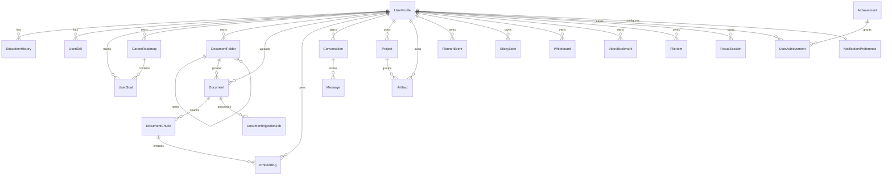

# Schema Diagram

## Major Domains

- Profile: `UserProfile`, `EducationHistory`, `UserSkill`, `UserGoal`.
- Documents: `DocumentFolder`, `Document`, `DocumentChunk`, `DocumentIngestionJob`.
- AI/RAG foundation: `Embedding`, `Conversation`, `Message`.
- Planning: `CareerRoadmap`, `UserGoal`.
- Gamification: `Achievement`, `UserAchievement`.
- Notifications: `NotificationPreference`.
- Legacy-compatible workspace: `Project`, `Artifact`, `PlannerEvent`, `StickyNote`, `Whiteboard`, `VideoBookmark`, `FileItem`, `FocusSession`.

